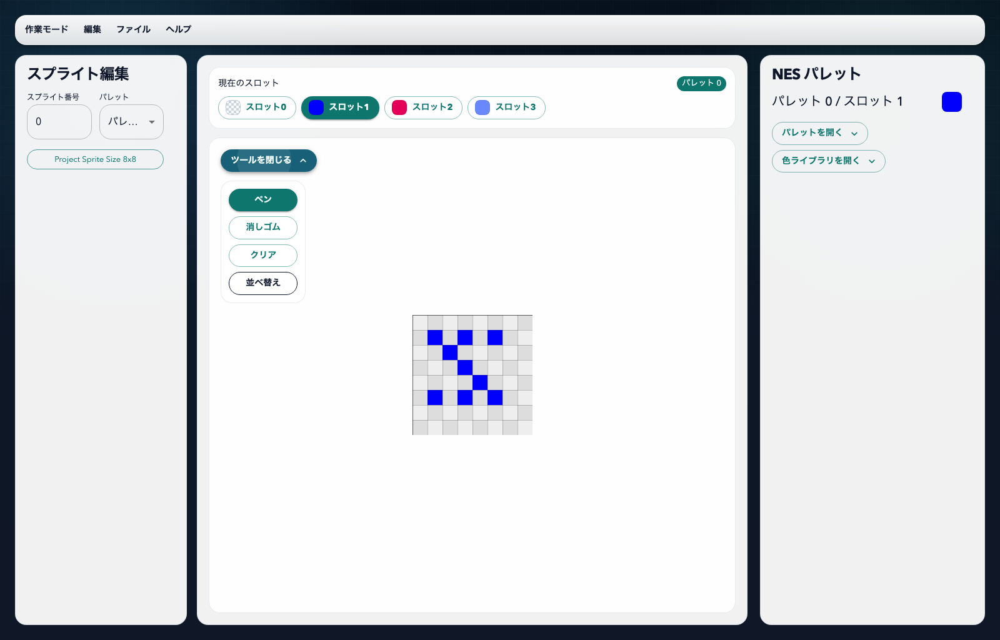
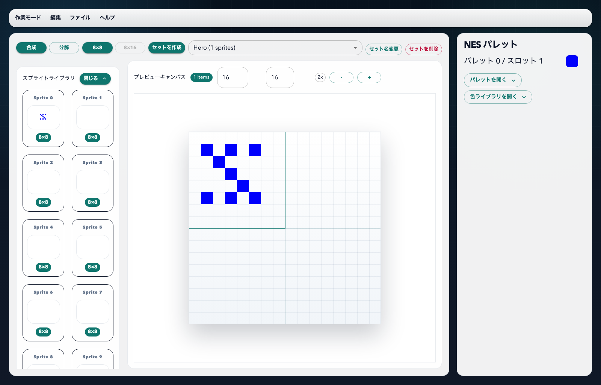
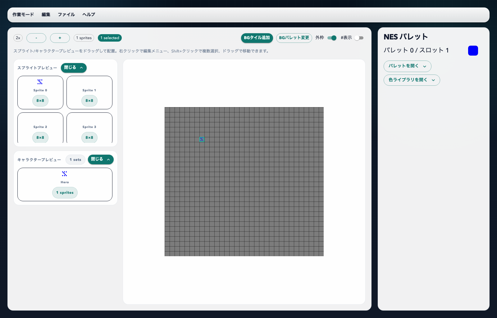

# NESDOT

NESDOT は、NES / ファミコンのスプライト制約を意識しながらドット絵を組み立てるためのエディタです。Tauri + React + TypeScript で構成されており、デスクトップアプリとして使いながら、フロントエンド単体でも確認できます。

「NES らしい見た目を崩さずに、スプライト単位の編集からキャラクター構成、背景タイル編集、最終的な画面配置まで一気に触りたい」という用途を主眼にしています。

## スクリーンショット

### スプライト編集

### キャラクター編集

### 画面配置

## できること

### スプライト編集モード

- 64 枚のスプライトスロットを編集できます
- 描画ツールは `ペン` / `消しゴム` / `クリア`
- `8x8` 単位でブロックをドラッグして並べ替えできます
- スプライトごとにパレット (`0..3`) を選択できます
- CHR / PNG / SVG の書き出し、プロジェクト JSON 保存 / 復元ができます

### キャラクター編集モード

- キャラクターセットの作成 / 選択 / リネーム / 削除ができます
- 合成モードでは、スプライトライブラリからステージへドラッグ配置できます
- 配置済みスプライトの移動、レイヤー変更、削除ができます
- 分解モードでは、分解キャンバスに描画して切り取り領域を定義し、既存スプライト再利用と空きスロット割り当てを解析して反映できます
- キャラクター単位で PNG / SVG / キャラクター JSON を書き出せます

### BG編集モード

- 256 枚の BG タイルを一覧から選んで編集できます
- 描画ツールは `ペン` / `消しゴム`
- 表示用パレットを切り替えながらタイルを確認できます
- 選択中 BG タイルを CHR / PNG / SVG で書き出せます

### 画面配置モード

- 画面サイズ `256x240` 上にスプライトを配置できます
- 単体スプライト追加に加えて、キャラクターセットをまとめて配置できます
- `BGタイル追加` ダイアログから背景タイルを `32x30` の画面へ配置できます
- `BGパレット変更` ダイアログから `16x16` 単位で背景パレットを塗り分けできます
- 選択中スプライトの座標、優先度、反転 (`H / V`)、削除ができます
- 複数選択したスプライトのグループ移動ができます
- 画面プレビューはズーム / パンに対応します
- PNG / SVG の書き出し、プロジェクト JSON 保存 / 復元ができます

## 再現している NES の制約

- スプライトの色は 4 色パレット単位で扱う
- スプライトパレットは 4 組
- 透明色は各パレットの `slot0`
- 画面上に配置できるスプライト総数は最大 `64`
- 同一スキャンライン上のスプライト数は最大 `8`
- スプライトサイズはプロジェクト単位で `8x8` または `8x16`

## 現状の制限

- BG編集モードは現在 `color index 0 / 1` の直接編集に絞っており、UI から `2 / 3` を直接打つ導線はまだありません
- 画面配置モードの背景編集は `BGタイル追加` / `BGパレット変更` の一時モードで行う構成で、常設トグルやスポイトはまだありません
- 一部入力では画面外座標を厳密拒否せず、描画時にクリップされる経路があります
- 自動永続化のための IndexedDB 実装はありますが、現在のストアでは無効化されており、実用上は JSON 保存 / 復元を使う形です

## 開発者向け情報

開発環境構築、WSL 運用、Nix / CI / security / release 検証、VS Code task、README 用スクリーンショット更新は [`docs/development-manual.md`](./docs/development-manual.md) を参照してください。

リリース runbook は [`docs/release-checklist.md`](./docs/release-checklist.md) にあります。
